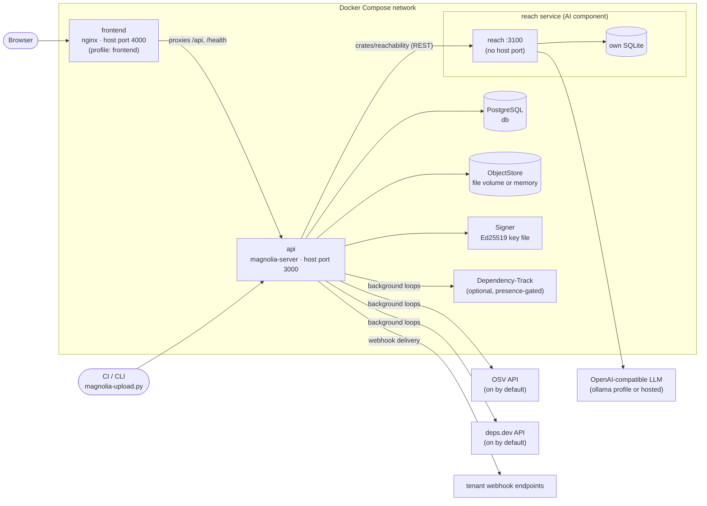
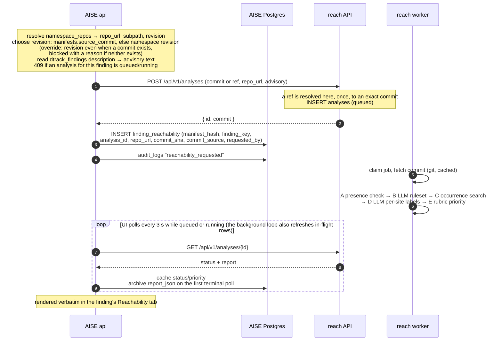
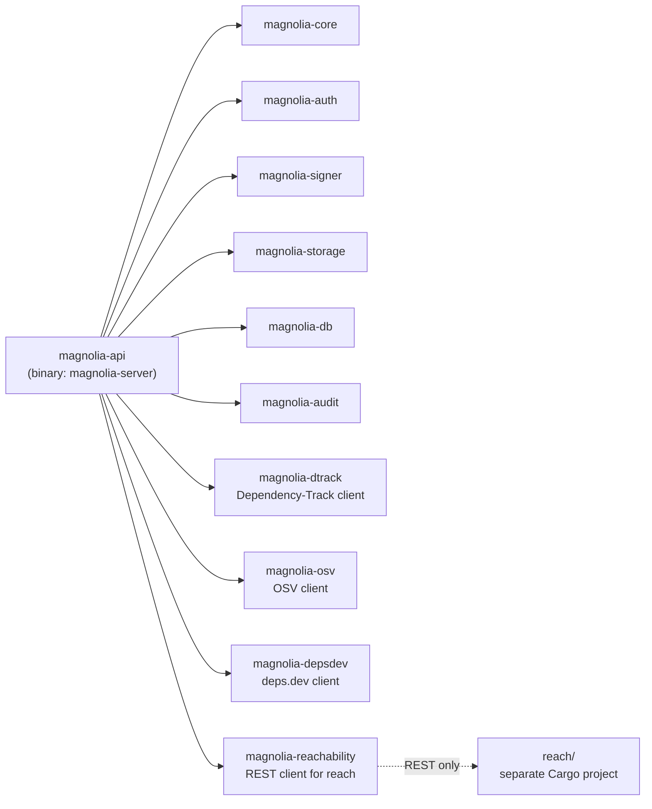

# Magnolia Architecture

## Overview

Magnolia (the AISE course project) is a multi-tenant service for software
supply-chain observability and transparency. At its core is a signed,
append-only Merkle transparency log of SBOMs and related documents. Around
that log sit signals that change over time: vulnerability findings from
Dependency-Track, malicious-package matches from OSV, OpenSSF Scorecard
reputation and freshness/EOL from deps.dev, license policy, compliance
profiles, VEX triage, and webhooks. A separate service, `reach`, adds
LLM-assisted **CVE reachability evidence**. EU Cyber Resilience Act compliance
is one application of this system, not its whole purpose.

It is written in Rust (axum, sqlx, tokio) with PostgreSQL and a React/TypeScript
frontend. It deploys with Docker Compose.

## Design Philosophy

- **Evidence is immutable, and signals are derived from it.** An SBOM's bytes
  and its log entry never change. Vulnerability, reputation, and freshness data
  change constantly, so they live in separate tables that background loops
  refresh. They are never written into the signed record.
- **Standard, externally verifiable crypto.** Tree heads and manifests use
  Ed25519 signatures. Manifests are DSSE envelopes around in-toto v1
  Statements. A third party can verify them with off-the-shelf tooling (cosign,
  openssl) using `GET /api/v1/signing-key`, without trusting Magnolia's code.
- **Secondary concerns never break the primary flow.** Integrations with
  Dependency-Track, OSV, deps.dev, webhooks, and the reachability analyser are
  either presence-gated or disableable. Their calls run in background loops or
  spawned tasks, and their failures are logged, not propagated. An upload
  succeeds even when every integration is down.
- **Pragmatic MVP.** Traits mark the seams where production backends would
  plug in (`Signer`, `ObjectStore`). The implementations shipped today are
  local ones: a key file and the filesystem or memory.

## System Architecture



By default only `api` publishes a host port. The frontend publishes one only
when its profile is enabled. `db`, `dependency-track`, and `reach` are
reachable only on the compose network.

## Workspace Crates

| Crate | Role | Internal deps |
|---|---|---|
| `magnolia-api` (`crates/api`) | axum router, `AuthGrant` extractor, handlers, background loops, snapshot export, webhooks. Binary: `magnolia-server`. | all below |
| `magnolia-core` | Pure domain logic with no I/O: MMR + proofs, signed tree heads, DSSE/in-toto types, compliance profiles, license policy evaluation, component extraction, purl, freshness, VEX import, SBOM schema validation | none |
| `magnolia-auth` | API key generation, hashing, and verification; `Role`, `Action`, `Grant`, `RbacEngine`; `examples/bootstrap_key.rs` | none |
| `magnolia-signer` | `Signer` trait + `LocalFileSigner` (Ed25519) | none |
| `magnolia-storage` | `ObjectStore` trait + `FileStore`, `InMemoryStore` | none |
| `magnolia-db` | Every Postgres query (`lib.rs`) and the record models | none |
| `magnolia-audit` | `AuditLogEntry` and an in-process `AuditLogger` | none |
| `magnolia-dtrack` | Dependency-Track REST client | none |
| `magnolia-osv` | OSV REST client | none |
| `magnolia-depsdev` | deps.dev REST client | none |
| `magnolia-reachability` | Thin typed REST client for `reach` | none |

`reach` is deliberately **not** in this workspace. It is a separate Cargo
project under `reach/`, with its own lockfile and its own `[workspace]`, and
the root manifest lists it under `exclude`. The only link between it and
AISE is the REST call made by `magnolia-reachability`. See "CVE reachability
analyser" below.

`AppState` (`crates/api/src/state.rs`) wires these together: `Arc<Database>`,
`Arc<dyn ObjectStore>`, `Arc<dyn Signer>`, one in-memory `MerkleTree` per
tenant behind a `Mutex`, the audit logger, and one `Option<Arc<Client>>` per
optional integration. A `None` client means "the feature is off", never an
error.

## Core Layers

### Cryptographic core (`magnolia-core`)

**Merkle Mountain Range** (`merkle.rs`)
- Append-only. Each tenant has its **own** tree and signed-tree-head chain, so
  one tenant can't learn anything about another's log.
- Domain-separated SHA-256 hashing: `H(0x00 ‖ leaf)` for leaves and
  `H(0x01 ‖ left ‖ right)` for internal nodes. The leaf is the raw SBOM bytes.
- The tree keeps its full append sequence in memory so it can produce proofs
  for any historical or current leaf. On startup the server rebuilds every
  tenant's tree from `merkle_leaves` (`load_all_leaf_hashes_by_tenant`).
- `InclusionProof` gives a sibling path up to the leaf's mountain peak, plus
  all peaks. The verifier folds the peaks left to right to get the root.
- `ConsistencyProof` shows that each old peak hashes up into a new peak, which
  proves the first `old_size` leaves were not modified or reordered.
- Both proofs are also verified client-side in the UI (`frontend/src/merkle.ts`).

**Signed Tree Head (STH)**
- `(tree_size, root_hash, frontier, signature, created_at)`. The signature is
  Ed25519 over `tree_size (u64 big-endian) ‖ root_hash`.
- One row per append, keyed by `(tenant_id, tree_size)`.

**Manifests: DSSE + in-toto** (`dsse.rs`)
- Every upload produces an in-toto v1 Statement:
  - Subject: `{domain}{namespace}@{version}`, with digest `sha256` equal to
    the SBOM hash, which is also the hash fed to the tree. The signature
    therefore binds the metadata to that exact content.
  - Predicate: `https://magnolia.dev/attestations/manifest/v1` for SBOMs, or
    `…/document/v1` for generic documents. It carries version, namespace,
    `previous_manifest_hash`, creator, and timestamp.
- The Statement is signed over the DSSE PAE with payload type
  `application/vnd.in-toto+json`. The envelope is stored in
  `manifests.dsse_envelope`.
- Manifests form a per-tenant **hash chain** through `previous_manifest_hash`.
- Rows from before DSSE keep their legacy `signature` column, and the API
  reports them as older than the scheme instead of pretending they were
  upgraded.
- `POST /api/v1/snapshot` builds a signed tar archive of the manifests in
  scope, with a `…/snapshot/v1` predicate.

**Policy checks (pure functions, unit-tested)**
- `compliance.rs`: the `ComplianceProfile` trait, with `Tr03183Profile` (BSI
  TR-03183-2) and `NtiaProfile`. Each profile is enabled per tenant.
- `license.rs`: evaluates a tenant license policy against extracted components.
- `schema_validation.rs`, `component_index.rs`, `purl.rs`, `freshness.rs`,
  `vex_import.rs`.

### Signing (`magnolia-signer`)

```rust
#[async_trait]
pub trait Signer: Send + Sync {
    async fn sign(&self, data: &[u8]) -> Result<Vec<u8>, SignerError>;
    async fn verify(&self, data: &[u8], signature: &[u8]) -> Result<bool, SignerError>;
    async fn public_key(&self) -> Result<Vec<u8>, SignerError>;
}
```

**Current implementation: `LocalFileSigner`.** It makes real Ed25519
signatures (`ed25519-dalek`). The 32-byte signing seed is `SHA-256` of the
key file's contents, so a key file of any format works as-is. The server
creates the key at `SIGNING_KEY_PATH` if it is missing. The private key sits
on disk; `Signer` is a trait so that a Vault, KMS, or HSM signer can replace
it without touching call sites.

### Object storage (`magnolia-storage`)

```rust
#[async_trait]
pub trait ObjectStore: Send + Sync {
    async fn put(&self, key: &str, data: &[u8]) -> Result<(), StorageError>;
    async fn get(&self, key: &str) -> Result<Vec<u8>, StorageError>;
    async fn exists(&self, key: &str) -> Result<bool, StorageError>;
    async fn delete(&self, key: &str) -> Result<(), StorageError>;
}
```

- **`FileStore`**: one file per key under `STORAGE_PATH`. This is what Docker
  Compose uses.
- **`InMemoryStore`**: the fallback when `STORAGE_PATH` is unset. SBOM content
  is lost on restart, and `GET /api/v1/config` reports `storage_backend` so the
  UI can warn about it.
- Keys are always generated by the server (`tenants/{tenant_id}/sboms/{sha256}.sbom`)
  and never built from user input.
- No S3/Object Lock implementation exists yet. The `sbom_s3_key` column name
  predates this and is simply the storage key.

### Multi-tenancy & RBAC (`magnolia-auth`, `crates/api/src/auth.rs`)

**API keys**
- Format: `mag_<43 base64url chars>`, with 256 bits of CSPRNG entropy. The key
  is shown once and stored as `sha256:<hex>`, which is unsalted and
  deterministic. That is safe because the input has so much entropy, and it
  means authentication looks the row up by hash (unique index on
  `api_keys.key_hash`). Comparison is constant-time.
- Legacy keys shaped `<key_id>:<secret>` and legacy `$argon2` hashes still
  verify. `ApiKeyVerifier` dispatches on the stored hash's prefix.
- `AuthGrant` is the axum extractor. It resolves the bearer token to a `Grant`
  (tenant, domain, namespace scope, role, expiry, revoked flag). Audit logs
  record the principal as `apikey:<key_id>`.

**Tenants and namespaces**
- Tenant = domain (`tenants` table). Every key, leaf, manifest, finding, and
  audit row belongs to exactly one tenant.
- Exactly one tenant has `is_platform = true`: the one created from
  `BOOTSTRAP_SUPER_ADMIN_KEY` on startup. That flag can't be set through the
  API. Only a `super_admin` key **of the platform tenant** may pass
  `?tenant_id=` to act on another tenant, and the platform tenant itself
  rejects SBOM uploads.
- Namespaces are hierarchical paths (`/product/v1`). A key's
  `namespace_scope` matches by whole path segment: `/p1` covers `/p1` and
  `/p1/sub` but not `/p10`, and `/` covers everything. A tenant can optionally
  require namespaces to be registered before anything is uploaded to them.

**RBAC matrix** (`RbacEngine::require_role`: revoked → expired → domain →
namespace scope → matrix)

| Action | super_admin | domain_admin | uploader | auditor |
|---|---|---|---|---|
| `Upload` | ✓ | ✓ | ✓ | ✗ |
| `Read` | ✓ | ✓ | ✗ | ✓ |
| `Annotate` (triage, comments) | ✓ | ✓ | ✗ | ✓ |
| `ManageKeys` | ✓ | ✓ | ✗ | ✗ |
| `ManageAcls` | ✓ | ✓ | ✗ | ✗ |
| `ManageSettings` (tenant toggles, policies) | ✓ | ✓ | ✗ | ✗ |
| `ManageTenantData` (bulk cache deletion, tenant-wide dependency views) | ✓ | ✗ | ✗ | ✗ |
| `ManageTenants` (create/list tenants; platform-level, skips the domain check) | ✓ | ✗ | ✗ | ✗ |

Handlers add their own extra rules on top of the matrix. For example,
revoking a manifest needs `auditor` or higher, and `DEV_MODE=true` also lets
an `uploader` do it.

### Data layer (`magnolia-db`)

Every query lives in `crates/db/src/lib.rs`. sqlx checks them at runtime, so
a SQL error only shows up when that query actually runs. On startup the server
applies `migrations/*.sql` with `sqlx::migrate!`. Migrations are append-only
and named `YYYYMMDD00000N_name.sql`.

**Transparency log**

| Table | Contents |
|---|---|
| `tenants` | `id`, `domain` (unique), `name`, `is_platform`, and the per-tenant toggle columns |
| `merkle_leaves` | `seq_id`, `tenant_id`, `tenant_leaf_index` (unique per tenant), `namespace`, `sbom_s3_key`, `leaf_hash`, `status` |
| `signed_tree_heads` | PK `(tenant_id, tree_size)`, `root_hash`, `signature`, `frontier BYTEA[]` |
| `manifests` | `manifest_hash` PK, `leaf_seq_id` → leaf, `tenant_id`, `version`, `sbom_hash`, `sbom_format`, `document_type`, `sbom_s3_key`, `namespace`, `previous_manifest_hash`, `dsse_envelope JSONB`, `created_by`, revocation fields, `source_commit`, … |
| `merkle_nodes` | Created by the initial schema; currently unused, since proofs come from the in-memory tree |

**Identity & audit**: `api_keys` (`key_hash` unique, `role`,
`namespace_scope`, `expires_at`, `revoked`), and `audit_logs` (`principal`,
`action`, `resource`, `result`, `reason`), written by `record_audit` to both
the DB and the in-process `AuditLogger`.

**Components & signals**: `sbom_components` (extracted per manifest,
including the license expression), `dtrack_projects`, `dtrack_findings` (with
VEX triage fields), `dtrack_push_failures`, `finding_comments`,
`malicious_component_findings`, `component_reputation`, `component_freshness`.

**Tenant configuration**: `compliance_profile_settings`,
`tenant_license_policies`, `registered_namespaces`,
`namespace_current_hidden`, `webhook_endpoints`, `webhook_deliveries`,
`namespace_repos`, `finding_reachability`.

### HTTP layer (`magnolia-api`)

Every route is defined in `create_router` (`crates/api/src/lib.rs`). All
`/api/v1` routes take `Authorization: Bearer mag_…`.

| Group | Endpoints |
|---|---|
| Meta | `GET /health`, `/install.sh`, `/install.py` (CLI served from the instance), `/api/v1/whoami`, `/config`, `/signing-key` |
| Log | `POST /upload`, `POST /verify` (dry-run CI gate), `/tree-head/latest`, `/tree-head/:size`, `/proof/inclusion/:i`, `/proof/consistency/:old/:new`, `/leaves`, `POST /snapshot` |
| Manifests | `/manifest/:hash`, `…/vex`, `POST …/vex/import`, `…/diff`, `POST …/revoke`, `/manifests/current`, `/namespaces/manifests` |
| Findings | `/findings`, `POST …/findings/:key/triage`, `…/findings/:key/comments`, `…/findings/:key/reachability` |
| Search | `/search/components`, `POST /search/reindex`, `/components/affected`, `/vulnerabilities/:id/affected` |
| Signal control | `POST /dtrack/sync`, `/reputation/{sync,status,components}`, `/freshness/{sync,status}`, `/malicious/{sync,status}` |
| Settings | `/settings/{dtrack-sync,semver-version,reputation-sync,freshness,malicious-check,namespace-registration,license-policy,namespace-repos}`, `/compliance/{profiles,settings}`, `/namespaces/{hidden,registered}` |
| Admin | `/keys`, `POST /keys/:id/revoke`, `/tenants`, `DELETE /tenants/:id`, `POST /tenants/cache/clear`, `/audit-logs` |
| Webhooks | `/webhooks`, `PATCH`/`DELETE /webhooks/:id`, `POST …/test`, `…/deliveries` |

The full reference, with permissions, parameters, response shapes and
error codes for all 78 method/path pairs, is **[docs/API.md](docs/API.md)**.
No OpenAPI document exists for this API yet. `reach` has one.

### Background processing

Each loop is spawned in `main.rs`. Every one catches and logs its per-item
failures and never propagates them, so one bad SBOM or an outage in an
external service can't kill a loop or affect request handling. They share the
cadence helper `sync_loop::run_burst_loop`: it works through a backlog at
`SYNC_BURST_INTERVAL_SECS` spacing, then idles for the full interval.

| Loop | Does | Gate |
|---|---|---|
| `dtrack_sync::run_sync_loop` | Pushes CycloneDX BOMs to Dependency-Track and pulls findings into `dtrack_findings` | `DTRACK_URL` + `DTRACK_API_KEY`/`_FILE`; tenant toggle |
| `malicious_sync` | Checks components against OSV malicious-package advisories | on by default, `DISABLE_MALICIOUS_PACKAGE_CHECK`; tenant toggle |
| `reputation_sync` | Fetches OpenSSF Scorecard data from deps.dev and buckets it (`reputation_bucket.rs`) | on by default, `DISABLE_REPUTATION_CHECK`; tenant toggle |
| `freshness_sync` | Fetches latest-version and EOL data from deps.dev | same client as reputation; tenant toggle |
| `reachability::run_reachability_auto_loop` | Refreshes the cached status of in-flight analyses, then queues analyses for untriaged findings on the current manifest of namespaces with `auto_analyze`, most severe first, capped at `REACHABILITY_AUTO_MAX_IN_FLIGHT` | `AISE_REACH_BASE_URL` + `AISE_REACH_TOKEN`; per-namespace `auto_analyze`; `DISABLE_REACHABILITY_AUTO` |
| `webhooks::run_webhook_delivery_loop` | Delivers queued events with capped retries and backoff. Bodies are HMAC-SHA256-signed (`X-Aise-Signature`). Loopback, private, link-local, and metadata IPs are refused to prevent SSRF | always on |

Webhook events: `manifest.uploaded`, `manifest.revoked`,
`finding.new_critical`, `malicious.match_found`, `dtrack.push_failed`.

## Data Flow: Upload Path

`POST /api/v1/upload` (`handlers::upload_sbom`):

1. **Auth.** `AuthGrant` resolves the bearer key (`401` if it can't).
2. **Parse and validate.** The multipart fields are `sbom_file`, `format`
   (`cyclonedx|spdx|document`), `namespace`, `version`, and the optional
   `document_type`, `source_commit`, `source_repo`, `source_subpath` and
   `source_revision`. A malformed `source_commit` or source repository is
   rejected, not dropped. Then the size limit (10 MiB), the format and
   `validate_sbom_content` are checked.
3. **Permission and policy.** The tenant is resolved (cross-tenant only for
   the platform super_admin), then `Upload` is checked in the target
   namespace. Next, `enforce_compliance` runs the tenant's enabled profiles
   and `enforce_license_policy` runs the license policy. Then come the
   optional SemVer and registered-namespace requirements, and the
   platform-tenant refusal.
4. **Store.** The SBOM hash is `sha256(bytes)`, and the bytes are written with
   `ObjectStore::put("tenants/{tenant}/sboms/{hash}.sbom")`.
5. **Append and sign.** Under the tree lock: `tree.add_leaf(bytes)`, then build
   the STH and sign it with Ed25519.
6. **Persist the log.** `insert_merkle_leaf` (status `locked`), then
   `insert_signed_tree_head`.
7. **Manifest.** Load the tenant's previous manifest, build the in-toto
   Statement, sign the DSSE PAE, and insert the manifest with its envelope and
   `source_commit`.
8. **Side effects, none of which can fail the upload:**
   - if the upload declared a `source_repo`, record it as the namespace's
     repository mapping (`set_namespace_repo_from_upload`), unless an admin
     already set one in Settings;
   - emit the `manifest.uploaded` webhook;
   - `index_manifest_components`, which only logs a warning on failure;
   - spawn Dependency-Track `sync_now` and deps.dev reputation and freshness
     passes;
   - `record_audit("upload")`.
9. **Response.** `{ sbom_hash, manifest_hash, version, namespace, domain,
   tree_size, leaf_index, leaf_seq_id, signed_tree_head }`, plus
   `source_repo` (`recorded` / `kept_existing` / `not_recorded`) when one was
   declared.

`POST /api/v1/verify` is the dry-run CI gate. It runs the same schema,
compliance-profile, and license-policy checks as upload, plus a synchronous
malicious-package check. It returns a machine-readable pass/fail report per
check. Reputation and Dependency-Track findings are asynchronous, so they are
reported as `not_evaluated`. No namespace or version is required, and nothing
is stored, appended, or signed. `scripts/magnolia-upload.py verify` wraps it
for CI.

### Consistency trade-off

Steps 4–7 are **sequential writes, not one database transaction.** The
in-memory tree is updated before the leaf and STH rows are written. A crash
or DB error partway through can therefore leave an orphaned stored object, or
an in-memory leaf that a restart discards because it rebuilds from
`merkle_leaves`. The design deliberately accepts this for the MVP:

- Stored objects are content-addressed, so an orphan is harmless, and
  re-uploading produces a new, consistent entry.
- The durable log is `merkle_leaves` plus `signed_tree_heads`, and the startup
  rebuild always matches it.
- A crash between the leaf insert and the STH insert leaves a leaf without a
  tree head at that size. The next successful upload signs a head that covers
  it.

Wrapping steps 6–7 in one transaction (and running the append under the same
critical section) is the obvious hardening step. It is listed under
Production Readiness.

## Findings, Triage & VEX

- Findings are read only after the manifest's tenant-ownership check, so a
  single Dependency-Track instance shared by all tenants cannot leak data
  through Magnolia. Dependency-Track's own admin surface is, however, shared
  across the whole deployment.
- Analysts set Magnolia's own VEX status per finding: `affected`,
  `not_affected` (requires a justification), `fixed`, or
  `under_investigation`. The change is audited and pushed back to
  Dependency-Track synchronously, the one deliberate synchronous
  Dependency-Track call.
- VEX can be exported per manifest (`GET …/vex`) and imported (`POST
  …/vex/import`, parsed by `core::vex_import`).
- Blast radius: `GET /components/affected` and `GET /vulnerabilities/:id/affected`
  answer "which manifests contain X / are affected by Y", honouring namespace
  scope.

## CVE reachability analyser (`reach/`)

A separate service, in this repository but outside its workspace. It answers
one question per finding: given an advisory and an **exact commit**, where
does that revision reference the symbols the advisory names?

### Why a separate service rather than a crate

- **Different failure domain.** An LLM call is slow (minutes against a local
  model) and fails in ways nothing else in AISE does. Behind a network
  boundary, an inference outage cannot exhaust AISE's request handlers or its
  Postgres pool, because AISE's calls only ever *queue* or *poll*.
- **Different data.** The analyser holds no tenant data, no SBOMs, and no keys,
  only jobs and reports. A single static bearer token is enough, so it doesn't
  need a second copy of AISE's multi-tenancy and RBAC.
- **Different lifecycle.** It scales, restarts, and deploys independently, and
  can be turned off entirely without touching AISE.

### Pipeline

| Stage | Kind | What |
|---|---|---|
| A | deterministic | Is the package present? Reads manifests and lock files plus an identifier index. If there is no evidence, the analysis stops here **without any LLM call**. |
| B | LLM | Turns the advisory into a ruleset: symbols, patterns, preconditions, nested-call patterns. The output is schema-validated with one repair retry. **Grounding:** every symbol must appear in the advisory text. |
| C | deterministic | Finds occurrences, ranked production code > tests > comments, and caps them. Tree-sitter widens snippets to the enclosing function or class. |
| D | LLM, per site | Assigns an ordinal label (`likely_relevant` / `unclear` / `likely_irrelevant`) and a cited line. **Citation check:** the line must exist and must lie inside the snippet the model was shown. |
| E | pure function | A rubric turns the rules that fired into a priority label plus a trace. The label is not a probability. |

Every stage degrades and records its outcome instead of aborting. The only
hard failure is being unable to fetch the requested source. On startup,
`reach` sends one real JSON-mode completion to the configured
OpenAI-compatible endpoint and exits if that fails. Once it is running, an
inference outage produces a report built only from the deterministic stages,
never a 5xx. Full details are in `reach/README.md`, including the security
model for fetching untrusted repositories, the eval suite, and the
limitations.

### Data flow



**Which revision.** A manifest's own `source_commit` is preferred. If it has
none, the namespace mapping's `revision` (branch, tag or commit) is sent as
`ref`, and `reach` resolves it once, at request time, to an exact commit that
it returns. A per-namespace testing override (`ignore_source_commit`) sends
the revision even when the manifest recorded a commit, for when that commit
is not in the mapped repository. `finding_reachability.commit_source` records
which happened (`manifest`, `namespace_revision` or `revision_override`), and
the UI states it; an override is shown as a warning. If neither a commit nor
a revision exists, the analysis is blocked with an explanation instead of
guessing a branch.

**Who queues it.** Either a person pressing the button (`Annotate`), or the
background loop for namespaces with `auto_analyze` (recorded and audited as
`system:reachability-auto`). The shared logic lives in
`crates/api/src/reachability.rs`. The loop and every status poll write the
analyser's latest `status`/`priority` into `finding_reachability`, which is a
cache for the findings-list badge and the loop's concurrency budget, not the
source of truth.

The analyser's SQLite database is the source of truth, and reads are proxied
to it. AISE also archives the report it receives (`report_json`) the first
time an analysis reaches a terminal state, so resetting the analyser does not
destroy evidence an analyst triaged against; when the analyser is unreachable
or has lost the analysis, AISE serves the archived copy and says so. The
report is stored and served as opaque JSON, never reshaped: its schema
belongs to `reach`, and a typed copy here would silently drop fields as it
grew.

### Schema added on the AISE side

Migration `20260830000003_reachability.sql`:

- `namespace_repos (tenant_id, namespace, repo_url, subpath, …)` records where
  a namespace's **own** source lives. It is explicit configuration following
  the tenant-settings pattern and is never inferred, because an SBOM
  component's URL points at the *dependency's* repository, which is the wrong
  tree to scan.
- `manifests.source_commit` is nullable. The upload CLI sends it as
  `git rev-parse HEAD`, and only from a clean tree. Without it, analysis uses
  the namespace's `revision` (resolved once to an exact commit) or is
  blocked; it never analyses a moving branch head.
- Migration `20260917000001_reachability_revision_auto.sql` adds
  `namespace_repos.revision` and `.auto_analyze`, plus
  `finding_reachability.commit_source`, `requested_ref` and the status cache
  (`status`, `priority`, `status_checked_at`).
- Migration `20260929000001_reachability_report_cache.sql` adds
  `finding_reachability.report_json` and `report_stored_at` (the archived
  report).
- Migration `20261002000001_namespace_repo_ignore_source_commit.sql` adds
  `namespace_repos.ignore_source_commit` (the testing override).
- A mapping's `created_by` starting with `magnoliafile:` marks one recorded by
  an upload; only those are ever replaced by a later upload.
- `finding_reachability` links a finding to an analysis and is append-only in
  practice. A re-run against a newer commit adds a new row, and the old one
  stays as the record of what was true then.

### Degradation

The feature is presence-gated on `AISE_REACH_BASE_URL`/`AISE_REACH_TOKEN`, the
same shape as the Dependency-Track integration. If the analyser is not
configured, the feature does not render. If it is unreachable, a stored
analysis shows status `unavailable` instead of an error. Inside the analyser
every pipeline stage degrades instead of aborting, so an inference outage
produces a deterministic-only report, never a 5xx and never a broken non-AI
flow.

## Frontend

This is a Create React App project in `frontend/`. Almost every view is a
top-level component in `src/App.tsx`: Dashboard, Upload, VerifyGateCheck,
Leaves/NamespaceTree, SbomDetailPanel, Findings (a list beside a
FindingDetail with Overview / Reachability / Triage tabs), ReachabilityPanel,
ComponentSearch, Proofs, Keys, Tenants, Audit, and Settings. The typed API
client is in `src/api.ts`, key handling in `src/context/ApiContext.tsx`, and
client-side proof verification in `src/merkle.ts`. Navigation shows only the
tabs the current key's role can use. The dev server (:4000) proxies `/api`
and `/health` to `127.0.0.1:3000`. In Compose, nginx serves the build and
proxies the same paths.

## Crate Dependency Graph



## Testing Strategy

1. **Unit tests** (`cargo test --workspace`). These cover:
   - MMR inclusion and consistency proofs, including tampered, reordered, and
     rewritten leaves;
   - the RBAC matrix and namespace-scope boundaries;
   - API key formats;
   - DSSE PAE and envelope construction;
   - compliance profiles and license policy;
   - VEX import;
   - the reachability client.
2. **`reach` tests** (`cd reach && cargo test`). A separate project covering
   the pipeline stages, the AI client failure modes and startup probe, git
   fetch hardening, and the in-process API.
3. **Real-data tests** (`tests/test_real_sboms.py`). They run against real
   CycloneDX and SPDX SBOMs in `test-sboms/`.
4. **Frontend**: `npx tsc --noEmit` and `CI=true npx react-scripts build`.
   eslint warnings fail the build.
5. **AI evaluation** (`reach/eval/`). 13 cases with aggregated metrics and a
   non-AI baseline; see `reach/README.md`.

No CI workflow runs these automatically yet.

## Production Readiness Checklist

- [x] Real asymmetric signatures (Ed25519) and standard DSSE/in-toto manifests
- [x] Per-tenant logs and data isolation, platform-tenant escalation guard
- [x] Persistent object storage (`FileStore`) and startup MMR rebuild
- [ ] Wrap the leaf, STH, and manifest writes in one DB transaction
- [ ] `S3Store` with Object Lock (WORM) instead of `FileStore`
- [ ] KMS/Vault/HSM `Signer` instead of the local key file, and tighten its file permissions
- [ ] PostgreSQL row-level security per tenant
- [ ] Rate limiting per API key; TLS via a reverse proxy (the api speaks plain HTTP)
- [ ] OpenAPI document for the AISE API
- [ ] CI workflow running the test suites
- [ ] Structured JSON logging, metrics, correlation IDs
- [ ] Retention policy (legal hold vs. deletion)

## Security Assumptions

1. **The signing key is secret.** Anyone holding the key file can forge tree
   heads and manifests. Verifiers get the public key from
   `GET /api/v1/signing-key`, or better, pin it out of band.
2. **Tamper-evidence comes from the log, not the storage.** Changing a stored
   SBOM changes its hash, so it no longer matches its leaf, and inclusion
   proofs fail. Rewriting history breaks consistency proofs against any tree
   head a verifier already holds. The storage itself is not yet WORM.
3. **API keys are bearer secrets.** Clients must store them securely. They are
   shown once and hashed at rest.
4. **Audit logs are append-only by convention.** The application never updates
   or deletes them, but the database does not enforce that.
5. **Tenant boundaries are enforced in the application layer.** Every query
   is tenant-scoped; there is no database-level RLS yet.
6. **External advisory text and repository content are untrusted**, both in
   the signal loops and in `reach`. See `reach/README.md` → Security.

---

**Last Updated:** 2026-10-03 (checked against the code: upload order and
source-repository fields, revision choice incl. the testing override, report
archive, reachability schema migrations, 13 eval cases, API reference moved to
docs/API.md)
