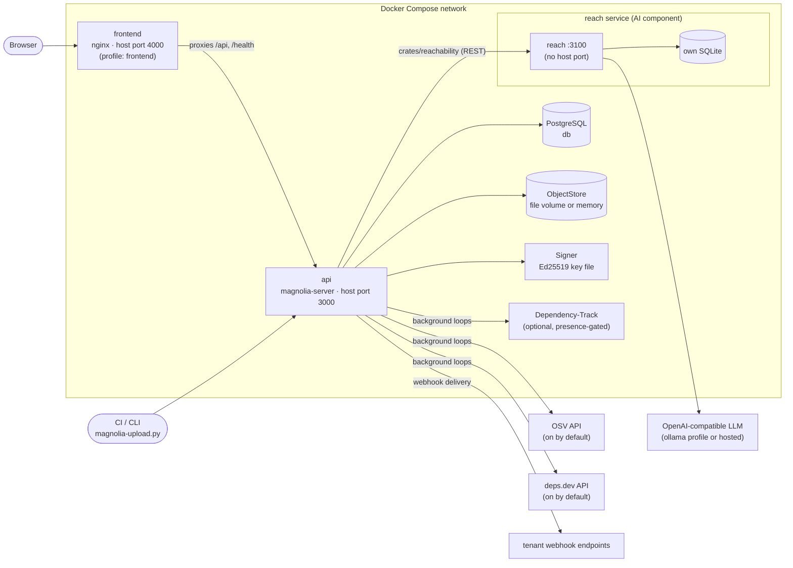
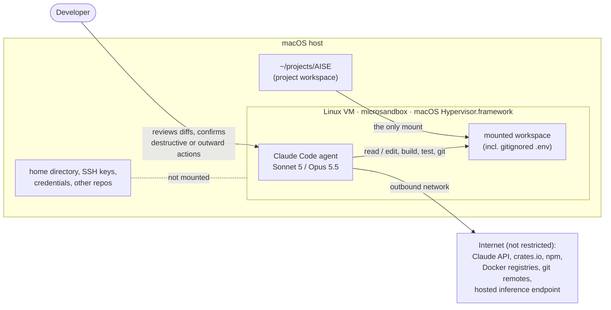

# Magnolia : supply-chain transparency with CVE reachability evidence

**The service keeps a signed, tamper-evident archive of a team's SBOMs and
helps analysts work through the vulnerability findings on them, using an
LLM to show where in the team's own code an advisory's vulnerable symbols
are referenced.**

University course project (AISE, 6 CP). Rust (axum, sqlx) + PostgreSQL +
React. The AI component is a separate service, `reach`, with its own SQLite
database and API.

| Document | Contents |
|---|---|
| [ARCHITECTURE.md](ARCHITECTURE.md) | Architecture, data flow and design decisions in depth |
| [docs/API.md](docs/API.md) | All 78 REST endpoints of the main API |
| [reach/README.md](reach/README.md) | The AI component: pipeline, security model, evaluation, limitations |
| [docs/OPERATIONS.md](docs/OPERATIONS.md) | Manual setup, Dependency-Track, VPS deployment, migrations |
| [docs/AI_DEVLOG.md](docs/AI_DEVLOG.md) | AI development log |
| [DELIVERABLES.md](DELIVERABLES.md) | Every course deliverable, with status and links |

## Contents

1. [Problem and responsibility](#1-problem-and-responsibility)
2. [Core user scenarios](#2-core-user-scenarios)
3. [The implemented core scenario](#3-the-implemented-core-scenario)
4. [Architecture and data flow](#4-architecture-and-data-flow)
5. [Persistence](#5-persistence)
6. [User interface](#6-user-interface)
7. [API and integration points](#7-api-and-integration-points)
8. [The AI component](#8-the-ai-component)
9. [Local model and inference server](#9-local-model-and-inference-server)
10. [Configuration](#10-configuration)
11. [Build, test and start](#11-build-test-and-start)
12. [Sandboxed agent setup](#12-sandboxed-agent-setup)
13. [Responsible design](#13-responsible-design)
14. [Known limitations](#14-known-limitations)

## 1. Problem and responsibility

A software team ships a product built from hundreds of open-source
dependencies. Its SBOM (software bill of materials) lists them, and a
vulnerability scanner turns that list into findings, often dozens per
release. Two problems follow:

- **Trust in the record.** When a customer or regulator (e.g. under the EU
  Cyber Resilience Act) asks "what exactly did you ship in 1.4.2, and when
  did you know?", the answer must come from a record nobody could quietly
  rewrite.
- **Too many findings to triage.** A finding says a dependency has a
  vulnerability, not that the team's code uses the vulnerable part. Analysts
  read advisories and grep code by hand to decide which findings matter.

**Responsibility.** Magnolia stores each uploaded SBOM in a signed,
append-only Merkle log, keeps the vulnerability findings and other supply-chain
signals on it up to date, and supports the analyst's triage. Its AI component
reads the advisory, extracts the vulnerable symbols, and reports where the
team's code at the SBOM's exact commit references them, as cited
`file:line` evidence. It never decides whether a finding is exploitable;
the analyst does.

## 2. Core user scenarios

1. **CI publishes a release.** A CI pipeline runs the upload CLI after a
   build. The SBOM is validated, checked against the tenant's policies,
   signed and appended to the log, together with the commit it was built
   from. Findings arrive from Dependency-Track shortly after.
2. **An analyst triages a finding with evidence** (the core AI scenario).
   The analyst opens a critical finding and starts a reachability analysis.
   A few minutes later they see the advisory's vulnerable symbols and the
   exact lines in their code that reference them, each with a label and a
   reason. They read the code, record a VEX decision (e.g. `affected`, or
   `not_affected` with a justification) and a comment.
3. **An auditor checks the record.** An auditor verifies that a manifest is
   included in the signed log and that the log has only grown (inclusion and
   consistency proofs, checked in the browser), and exports the team's triage
   decisions as an OpenVEX document.

## 3. The implemented core scenario

Scenario 2 end to end, through the web UI. Each step is persisted, and the
API calls behind it are listed in [docs/API.md](docs/API.md).

1. **Upload with source information.** CI runs `scripts/magnolia-upload.py`
   with a `Magnoliafile`. The upload records the SBOM, its `source_commit`
   (`git rev-parse HEAD`), and optionally the namespace's source repository
   (`source_repo=`).
2. **Findings.** The background sync pushes the SBOM to Dependency-Track and
   caches its findings, including the advisory text.
3. **Pick a finding.** *Findings* lists findings by severity. *Known source
   only* narrows it to namespaces with a mapped repository. Selecting one
   opens it beside the list, on the **Overview** tab: advisory, component,
   where else it occurs.
4. **Start the analysis.** On the **Reachability** tab, *Analyze
   reachability* queues an analysis at `reach` for the SBOM's exact commit.
   The list badge and the tab update while it runs.
5. **Read the evidence.** The report shows the advisory summary, the
   extracted symbols, preconditions worth confirming, and *Where to look*:
   each occurrence with its `file:line` (linked to that line at the analysed
   commit), snippet, label and reason. *How was this determined?* shows every
   rule that fired and every pipeline stage.
6. **Decide and record.** On the **Triage** tab the analyst sets the VEX
   status (`not_affected` needs one of the OpenVEX justifications) and adds a
   comment. The decision is stored, audit-logged, pushed to Dependency-Track,
   and exportable as OpenVEX.
7. **Correct later.** Triage can be changed at any time, and an analysis can
   be re-run; earlier analyses stay on record.

**Demo data.** The real-SBOM tests use `test-sboms/`. The AI pipeline's 13
evaluation fixtures (`reach/eval/fixtures/`) run end to end without network.
The UI walkthrough uses one dataset: the SBOM
`test-sboms/frontend-npm.cdx15.json`, uploaded to namespace `/demo/api`, plus
the small Express app `demo/shop-api/` as its source. That app really calls
some of the vulnerable APIs named in the findings:

| Finding | Code in `demo/shop-api` | Expected evidence |
|---|---|---|
| ejs CVE-2023-29827 | `ejs.render` with a merchant-set `closeDelimiter` (`src/mail/render.js`) | direct references |
| underscore CVE-2026-27601 | `_.isEqual` / `_.flatten` on request JSON (`src/routes/carts.js`) | direct references |
| uuid CVE-2026-41907 | only `v4` is used; the advisory names v3/v5/v6 | package present only |
| postcss, html-minifier-terser | used, but not through a symbol the advisory names | package present only |
| fast-uri | transitive only, not in the app's code | no package evidence |

To set it up:

1. Run `./scripts/demo-repo.sh`. It snapshots the app into a git repository
   under `demo/.repos/`, which compose mounts read-only into `reach` at
   `/demo-repos`.
2. Upload the SBOM to `/demo/api`.
3. Under Settings → Source repositories, map `/demo/api` to
   `/demo-repos/shop-api`, revision `main`, with "ignore SBOM commit" enabled.

For a UI walkthrough without a model, `REACH_TEST_MODE=true` makes `reach`
return a canned, clearly labelled report for every analysis
([reach/README.md → Test mode](reach/README.md#test-mode)).

## 4. Architecture and data flow



**Two services, one boundary.**

- **`api` (Magnolia)** owns the log, findings, triage, settings and the UI's
  API.
- **`reach`** owns analyses and their reports.
- They talk only over REST (`crates/reachability` → `POST/GET
  /api/v1/analyses`) and share no database or code. `reach` is a separate
  Cargo project, outside the workspace.
- `reach` starts on its own and is useful on its own, through its API and
  Swagger UI. Magnolia works fully without it; the reachability feature then
  simply doesn't appear.

**Data flow of an analysis.**

1. `api` resolves the finding's repository and revision, and the advisory
   text.
2. It sends them to `reach`, records the link in `finding_reachability`, and
   then polls.
3. `reach`'s worker runs five stages:
   - **A** package presence (deterministic)
   - **B** LLM extracts the vulnerable symbols from the advisory
   - **C** deterministic search for those symbols
   - **D** LLM labels each occurrence
   - **E** rubric (pure function) assigns the priority label
4. `api` caches the status and archives the final report.

The step-by-step sequence diagram and every design decision are in
[ARCHITECTURE.md](ARCHITECTURE.md).

## 5. Persistence

| Store | Owner | Holds |
|---|---|---|
| PostgreSQL (`db_data` volume) | `api` | Tenants, keys, the Merkle log (`merkle_leaves`, `signed_tree_heads`), manifests with DSSE envelopes, extracted components, cached findings with triage (`dtrack_findings`), comments, settings, webhooks, audit log, and the reachability link with its archived report (`finding_reachability`). 23 tables, created by the migrations in `migrations/`, which are applied on startup |
| `FileStore` (`signing_key` volume, `/data/sboms`) | `api` | The uploaded SBOM bytes, content-addressed |
| Key file (`signing_key` volume) | `api` | The Ed25519 signing key, created on first start |
| SQLite (`reach_data` volume) | `reach` | `analyses`: each job's input, status and full report |
| Git cache (`reach_cache` volume) | `reach` | Checked-out repositories, size-capped (`REACH_CACHE_MB`) |

How data is created, read, changed and deleted, for the parts that matter:

| Data | Created | Read | Changed | Deleted |
|---|---|---|---|---|
| SBOM log entries | Upload | Dashboard (archive explorer), proofs | Never (revocation is a flag) | Never |
| Reachability analyses (AI results) | *Analyze reachability* | Reachability tab | Re-run adds a new analysis; the old one stays | Not deletable (audit record) |
| Triage decisions | Triage tab, VEX import | Findings, VEX export | Triage tab, VEX import | Not deletable (can only be changed) |
| Source repository mappings | Settings, or an upload's Magnoliafile | Settings | Settings | Settings → *Remove* |
| Comments on findings | Triage tab | Triage tab | Append-only | Not deletable |

No other service reads either database. Dependency-Track keeps its own
database and is reached only through its REST API.

## 6. User interface

A React web UI (`frontend/`). In Compose it's served on port 4000; for
development, `npm start` also serves it on 4000. You log in by pasting an
API key. The navigation shows only what the key's role may use.

| View | For |
|---|---|
| **Findings** | The core scenario: a filterable list beside the selected finding, with *Overview*, *Reachability* (the AI evidence) and *Triage* tabs |
| Dashboard | Archive explorer: browse SBOMs by namespace and version; contents, compliance, findings, signals, diffs |
| Upload / Tools | Upload an SBOM; run the CI policy gate (`/verify`) without storing anything |
| Proofs | Inclusion and consistency proofs, verified in the browser |
| Component Search | Which releases contain component X; what a vulnerability affects |
| Settings | Tenant policies, signals, *Source repositories* (for reachability), webhooks |
| API Keys, Tenants, Audit Log | Administration |

## 7. API and integration points

| Interface | Documentation |
|---|---|
| Magnolia REST API, `http://127.0.0.1:3000/api/v1/…` | [docs/API.md](docs/API.md): all 78 endpoints with permissions, parameters, responses and errors. *No OpenAPI document yet* |
| `reach` REST API, `/api/v1/analyses` | Generated OpenAPI at `/openapi.json`, Swagger UI at `/docs` ([reach/README.md](reach/README.md#running-it)) |
| Upload CLI | `scripts/magnolia-upload.py`, served by the instance at `/install.py`; configured by a `Magnoliafile` (below) |
| Webhooks | Outgoing, HMAC-signed: `manifest.uploaded`, `manifest.revoked`, `finding.new_critical`, `malicious.match_found`, `dtrack.push_failed` |
| Dependency-Track, OSV, deps.dev | Outgoing REST from background loops; each is optional or can be disabled |
| LLM | Outgoing from `reach` only: `POST {REACH_AI_BASE_URL}/v1/chat/completions` |

**Upload CLI and Magnoliafile.** `Magnoliafile` is plain `key=value`, never
executed; values are taken verbatim after `=`, so keep comments on their own
line.

```ini
tenant_url=https://magnolia.example
tenant_domain=acme.example
namespace=/product/api
sbom=sbom.cdx.json
format=cyclonedx
# optional, for reachability analysis (https:// only)
source_repo=https://github.com/acme/api
# optional: monorepo sub-directory
source_subpath=services/api
# optional: scanned for uploads that carry no exact commit
source_revision=main
```

```bash
curl -fsSL <tenant_url>/install.py | python3 - --version=2.0.0                 # straight from the instance
MAGNOLIA_API_KEY='mag_<secret>' ./scripts/magnolia-upload.py --version=1.2.3   # upload
MAGNOLIA_API_KEY='mag_<secret>' ./scripts/magnolia-upload.py verify            # CI policy gate
```

The key comes only from `MAGNOLIA_API_KEY`, never from a flag or the
Magnoliafile. A `source_repo` from a Magnoliafile becomes the namespace's
mapping unless an admin set one in Settings, which always wins. The CLI says
which happened. The bash version (`/install.sh`) does not send `source_*`
fields.

## 8. The AI component

`reach` answers one question per finding: **given this advisory and this
exact commit, where is the vulnerable symbol referenced?** The model does two
narrow, validated jobs:

- stage B extracts the vulnerable symbols from the advisory text;
- stage D labels each occurrence the deterministic search found.

Removing the model leaves only a keyword search: the
[evaluation](#evaluation) shows what that loses. Full documentation:
[reach/README.md](reach/README.md).

### Evidence, not a verdict; uncertainty

- **The output is evidence for an analyst.** "`yaml.load` is called at
  `src/config.py:12`" is reported; "this CVE does not affect you" never is.
  Nothing in `reach` or the UI triages a finding.
- **Labels, not probabilities.**
  - Each occurrence gets one of three ordinal labels: `likely_relevant`,
    `unclear`, `likely_irrelevant`. `unclear` is the explicit "the model
    could not tell" answer.
  - The report's priority label (e.g. *Direct references found*) names the
    deterministic rubric rules that fired, listed in the report. It is not a
    score.
  - No confidence number is shown anywhere, because none has been
    calibrated.
- **Validation against source data instead of trust:**
  - **Grounding:** an extracted symbol that does not appear in the advisory
    text is dropped.
  - **Citation check:** a claim must cite a line that exists in the checkout
    and lies inside the snippet the model was shown, or it is dropped.
  - **Invalid answers:** a label outside the three is dropped; the
    occurrence stays, unlabelled.
  - Every report counts what was dropped, so the reader sees how much the
    model's output was trusted.
- **Every report carries its own disclaimer**, which the UI shows next to the
  label, and states which code was scanned. A substituted revision (no
  recorded commit, or the testing override) is shown as a warning.

### Failure handling

| Condition | What happens |
|---|---|
| Inference server unavailable | **During operation:** stages B/D record the failure; the report still contains the deterministic occurrences, unlabelled, capped at *references need review*; never a 5xx. **At startup:** `reach` refuses to start (exits, compose restarts it) so a misconfigured deployment is visible. In both cases Magnolia keeps working, and its UI says the analyser is unavailable and serves the archived report |
| Request times out | `REACH_AI_TIMEOUT_SECS` bounds every call; a timeout is recorded as that stage's failure and handled as above |
| Malformed or unexpected model output | JSON is validated app-side against the expected shape; **one** repair retry, then the stage degrades. Ungrounded symbols, uncited claims and invented labels are dropped and counted |
| Input cannot be processed | Missing advisory text, invalid commit/ref or repository URL: `400` before anything is queued. Unfetchable repository: the analysis ends `failed` with a reason for the analyst. Oversized advisory text is cut to `REACH_MAX_ADVISORY_CHARS` before it reaches a prompt (silently); an oversized repository is indexed up to its cap and the report says the scan is incomplete. A crash while scanning one repository fails that job only; the worker continues |
| Persisted data cannot be read or written | Both services log the detail and return a generic JSON `500`, never a partial result. `reach`'s worker backs off and retries on the next pass. If `reach` loses its database, Magnolia serves its archived copy of the report and says so. An upload's writes are sequential, not one transaction; the trade-off is described in ARCHITECTURE.md → Consistency trade-off |

### Evaluation

`reach/eval/`: 13 cases, run by a script (`cargo run --bin eval`), with
results as JSON in `reach/eval/results/`.

- **Categories covered:** nominal, package absent, advisory without symbols,
  ambiguous advisory, prompt injection via the advisory and via a code
  comment, malformed advisory, out-of-scope request, advisory-only fallback,
  lexical false positive, monorepo subpath, hallucination bait, and a
  generic symbol in qualified form.
- **Metrics:** extraction precision/recall/F1 and the same for a **non-AI
  keyword baseline**, priority accuracy, citation pass rate, structured-output
  first-try rate, per-label precision, injection resistance, latency.

| Run | Cases | Result |
|---|---|---|
| Deterministic path only (inference off), 2026-09-29 | 13 | 13/13 pass; priority accuracy 1.00; 2/2 injection cases resisted; baseline extraction P 0.62 / R 0.89 / F1 0.73 |
| Full, hosted `Qwen/Qwen3.6-35B-A3B-FP8`, 2026-09-29 | 1 (case 13) | Pass; AI extraction P/R 1.00/1.00 vs. baseline 0.00/0.00; 6 inference calls, 0 repairs; 165 s |
| Full, local `deepseek-r1:8b` (Ollama), 2026-08-30 | 1 | Pass; AI extraction F1 1.00 vs. baseline 0.67; structured output first try 0.86 (one repair); 479 s |

**Open:** a full AI run over all 13 cases, after the latest prompt change,
and a written failure-case analysis. See
[reach/README.md → Evaluation](reach/README.md#evaluation).

## 9. Local model and inference server

The assessed AI component runs on **`qwen3.8:27b`** (Qwen 3.8, 27B
parameters, 4-bit quantised) served by **Ollama**. No hosted API is involved.
`reach` uses only Ollama's OpenAI-compatible endpoint
(`POST {base_url}/v1/chat/completions`), so nothing in the code is specific to
Ollama or to Qwen.

**Why this model.**

- **Versatile, with usable code understanding.** Stage B has to read
  advisory prose and pull out real API names. Stage D has to read a code
  snippet and decide whether the cited line uses the vulnerable symbol. Both
  need a model that understands CVE text *and* code, not just one of them.
- **Larger than the smaller models tried.** Earlier runs used `gemma3:4b`
  and `deepseek-r1:8b`. A 4–8B model is the course's example size, but stage
  D needs more code understanding than that. 27B parameters at 4 bits is the
  largest size that still fits a single developer machine.
- **Text only is enough.** All inputs are advisory text and source code.
- **Structured output.** `reach` validates every answer as JSON itself and
  retries once, so the model only has to *usually* follow the schema (see
  [Failure handling](#failure-handling)).

**Server.** Ollama 0.35 (the version used in development).

**Hardware.** Development machine: Apple M4 Pro, 48 GB unified memory.

- The 4-bit weights are roughly 16–17 GB. The KV cache for the context
  length below comes on top of that.
- Plan for at least **32 GB of RAM/VRAM**, e.g. a 24 GB GPU or Apple Silicon
  with 32 GB or more.
- **On macOS, run Ollama natively**, not in the Compose `ollama` service.
  Docker on macOS has no GPU access, so a 27B model in a container runs on
  the CPU only and is too slow for the timeouts below. The Compose service is
  meant for Linux hosts with an NVIDIA GPU.

```
REACH_AI_BASE_URL=XYZ
REACH_AI_MODEL=qwen3.8:27b
REACH_AI_API_KEY=
REACH_AI_MAX_TOKENS=8000
REACH_AI_TIMEOUT_SECS=300
```

`reach` sends a real generation request to the model when it starts and
refuses to start if that fails, so a running `reach` means the model works.
`ollama ps` shows that the model is loaded and how much memory it uses.

Why these settings:

- **`OLLAMA_CONTEXT_LENGTH`:** Ollama's default context window is smaller
  than one stage B prompt (up to `REACH_MAX_ADVISORY_CHARS` = 12,000
  characters of advisory text plus instructions). Ollama cuts an overlong
  prompt silently, without an error. `reach` sets no context length itself,
  so set it on the server.
- **`REACH_AI_MAX_TOKENS`:** Qwen models may reason before they answer. If
  the default of 1024 tokens runs out during reasoning, the stage fails with
  `truncated_during_reasoning` and degrades. 8000 leaves room for reasoning
  plus the JSON answer.
- **`REACH_AI_TIMEOUT_SECS`:** must cover `REACH_AI_MAX_TOKENS` at local
  generation speed. 300 s is a starting value; raise it if `ollama ps` and the
  `reach` logs show calls timing out.

**Replacing the model or server.** It's a configuration change only. Change
`REACH_AI_MODEL` to swap the model, and `REACH_AI_BASE_URL` (plus
`REACH_AI_API_KEY` if needed) for any other OpenAI-compatible server, e.g.
llama.cpp's `llama-server`, vLLM or LM Studio. Development runs used a hosted
endpoint (Hetzner, `Qwen/Qwen3.6-35B-A3B-FP8`) as a stand-in in exactly this
way. After a swap, rerun the evaluation (`cd reach && cargo run --bin eval`),
because prompts behave differently on different models.


## 10. Configuration

Everything is configured through environment variables; nothing is hard-coded
per machine. For Compose, put them in a root `.env` (gitignored; template in
`.env.example`). Compose does **not** read `reach/.env`.

**Magnolia (`api`)**

| Variable | Default | Purpose |
|---|---|---|
| `DATABASE_URL` | – (required) | PostgreSQL connection |
| `SERVER_ADDR` | `127.0.0.1:3000` | Listen address |
| `BOOTSTRAP_SUPER_ADMIN_KEY` | – | Creates this super_admin key on startup (generate as in [Build, test and start](#11-build-test-and-start), or with `cargo run -p magnolia-auth --example bootstrap_key`). No built-in default |
| `BOOTSTRAP_TENANT_DOMAIN` / `_NAME` | `test.example` | The platform tenant for that key |
| `STORAGE_PATH` | unset = in memory | SBOM byte storage directory |
| `SIGNING_KEY_PATH` | `.sbomstash_key` | Ed25519 key file, created if missing |
| `DEV_MODE` | off | Dev-only relaxations; never in production |
| `DTRACK_URL`, `DTRACK_API_KEY` / `DTRACK_API_KEY_FILE` | – | Dependency-Track; off unless both are set |
| `DTRACK_SYNC_INTERVAL_SECS` | `600` | Dependency-Track sync cadence |
| `DISABLE_MALICIOUS_PACKAGE_CHECK`, `DISABLE_REPUTATION_CHECK` | off | Turn off OSV / deps.dev signals |
| `MALICIOUS_`, `REPUTATION_`, `FRESHNESS_SYNC_INTERVAL_SECS` | `3600` | Signal loop cadence |
| `SYNC_BURST_INTERVAL_SECS`, `WEBHOOK_DELIVERY_INTERVAL_SECS` | `30` | Backlog and webhook cadence |
| `AISE_REACH_BASE_URL`, `AISE_REACH_TOKEN` | – | The analyser; the feature is off unless both are set |
| `REACHABILITY_AUTO_INTERVAL_SECS` / `_MAX_IN_FLIGHT` | `120` / `2` | Background analysis of namespaces with *analyse automatically* |
| `DISABLE_REACHABILITY_AUTO` | off | Turn the background analysis off |

**reach (the AI component)**

| Variable | Default | Purpose |
|---|---|---|
| `REACH_AI_BASE_URL` | `http://localhost:11434` | OpenAI-compatible server (Compose: `http://ollama:11434`) |
| `REACH_AI_MODEL` | `gemma3:4b` | Model name |
| `REACH_AI_API_KEY` | – | Bearer token for the inference server, if it needs one |
| `REACH_AI_TIMEOUT_SECS` | `60` (Compose: `120`) | Per-call timeout |
| `REACH_AI_MAX_TOKENS` / `REACH_AI_TEMPERATURE` | `1024` / `0` | Inference settings |
| `REACH_API_TOKEN` | – (Compose: `dev-reach-token`) | Bearer token callers must send; unset = unauthenticated (logged as a warning) |
| `REACH_DB_PATH`, `REACH_SERVER_ADDR` | `reach.db`, `127.0.0.1:3100` | Storage and listen address |
| `REACH_CACHE_DIR` / `REACH_CACHE_MB` | `./.reach-cache` / `2048` | Git checkout cache |
| `REACH_GIT_TOKEN` | – | Token for private repositories (never put in URLs) |
| `REACH_MAX_REPO_MB`, `_MAX_SITES`, `_MAX_SCORED_SITES`, `_MAX_FILE_KB`, `_MAX_ADVISORY_CHARS` | `512`, `50`, `5`, `512`, `12000` | Hard caps on work done on untrusted input |
| `REACH_TEST_MODE` | off | Canned, labelled reports; no model needed |

Compose-only: `API_PORT` (3000), `FRONTEND_PORT` (4000), `POSTGRES_PASSWORD`.

## 11. Build, test and start

**Recommended: Docker Compose.** Needs only Docker (with Compose v2) and
`openssl`; no Rust or Node toolchain. Everything runs in containers: the
database, the web UI, the AI component, and Dependency-Track, which produces
the findings the core scenario works on.

```bash
cp .env.example .env
# 1. a bootstrap admin key (mag_ + 43 base64url characters)
echo "BOOTSTRAP_SUPER_ADMIN_KEY=mag_$(openssl rand 32 | base64 | tr '+/' '-_' | tr -d '=\n')" >> .env
# 2. the inference endpoint, in .env: REACH_AI_BASE_URL, REACH_AI_MODEL, REACH_AI_API_KEY
# 3. build and start everything; waits until reach has passed its model check
./scripts/stack-up.sh --frontend
#    without any model:         ./scripts/stack-up.sh --frontend --test-mode
#    without Dependency-Track:  ./scripts/stack-up.sh --frontend --no-dtrack  (no findings)
```

Open http://localhost:4000 and paste the key from `.env`. `curl
http://127.0.0.1:3000/health` returns `200`.

- `stack-up.sh` wraps `docker compose -f docker-compose.yml -f
  docker-compose.dtrack.yml --profile frontend up -d --build`: it checks
  `.env` first, waits for `reach`, and reports whether the Dependency-Track
  integration came up. That Compose command works on its own too.
- Dependency-Track's API key is set up automatically by a one-shot container
  (`dtrack-bootstrap`). On a fresh volume, Dependency-Track first downloads
  its vulnerability databases, which takes a while before findings appear;
  give Docker several GB of memory.
- Appending to `.env` is fine: when a variable appears twice, the later
  value wins.

Without Docker (only for development; needs Rust, Node and a PostgreSQL),
VPS deployment and migrations: [docs/OPERATIONS.md](docs/OPERATIONS.md).

**Tests and the eval suite** need the Rust toolchain (and Node for the
frontend checks); they run on the host, not in the containers.

**Tests.**

```bash
cargo test --workspace                       # 192 tests: log, proofs, RBAC, keys, DSSE, policies, VEX, reachability rules
cd reach && cargo test                       # 227 tests: pipeline stages, AI client failure modes, git hardening, API
python3 tests/test_real_sboms.py             # real, generator-produced SBOMs in test-sboms/
cd frontend && npx tsc --noEmit && CI=true npx react-scripts build
cd reach && cargo run --bin eval -- --baseline-only   # AI evaluation, deterministic half (no server)
cd reach && cargo run --bin eval                      # full AI evaluation against REACH_AI_BASE_URL
```

The AI client's tests run against a closed port and a `wiremock` mock
server, never a live model, so they are deterministic. The evaluation suite
is the live check.

## 12. Sandboxed agent setup

The project was developed with an AI coding agent; every change was reviewed
and verified with the commands above. Representative episodes, including
failures, are in [docs/AI_DEVLOG.md](docs/AI_DEVLOG.md).



| | |
|---|---|
| **Harness** | Claude Code (CLI): the agent reads and edits files in the workspace, runs build/test/git commands, and gets their results back |
| **Models** | Claude Sonnet 5 for routine tasks, Claude Opus 5.5 for harder ones (cross-service debugging, security review, architecture), chosen per task |
| **Sandbox** | The harness runs in a Linux VM started with [microsandbox](https://github.com/microsandbox/microsandbox), which uses the macOS hypervisor (Hypervisor.framework). The agent works inside the VM, not on the host |
| **File access** | Only the project workspace is mounted into the VM. The home directory, SSH keys, credentials and other repositories are not visible to the agent |
| **Network** | **Not restricted.** The VM has normal outbound access, which the work needs: crates.io, npm and Docker registries, git remotes, and the hosted inference endpoint. Compensating controls: no credentials beyond the workspace exist inside the VM, and outward-facing actions need confirmation (below) |
| **Secrets** | Inference keys and DB credentials live in `.env` (gitignored). It is inside the workspace, so the agent *can* read it; it is never put in prompts, source code or history, and the agent passes its values to commands without printing them |
| **Confirmation** | Destructive or security-relevant actions (deleting data, migrations against non-dev databases, force-pushes, commits, outward-facing actions) need explicit confirmation |
| **Review** | Every change is checked with the verification steps in [Build, test and start](#11-build-test-and-start) before it is accepted |

## 13. Responsible design

**Privacy.**

- Stages B and D send the advisory text and **snippets of the scanned source
  code** (a few lines to one enclosing function per occurrence, at most
  `REACH_MAX_SCORED_SITES` per analysis) to the configured inference
  endpoint.
- With a hosted endpoint, that code leaves your infrastructure. For private
  code, point `REACH_AI_BASE_URL` at a server you operate.
- `reach` keeps cloned repositories in its cache volume. It holds no tenant
  data, SBOMs or user identities.

**Security.**

- Repository content and advisory text are treated as untrusted:
  - both are fenced in prompts, and the evaluation includes prompt-injection
    cases;
  - git runs with a scheme allowlist, argv-injection checks, no credentials
    in URLs, and size and time caps
    ([reach/README.md → Security](reach/README.md#security)).
- Magnolia:
  - API keys are 256-bit, stored as hashes and shown once;
  - role- and namespace-scoped RBAC, and per-tenant isolation in every
    query;
  - webhooks refuse private and metadata addresses.
- `reach` has no host port and requires a bearer token.
- Neither service terminates TLS; production needs a reverse proxy
  ([docs/OPERATIONS.md](docs/OPERATIONS.md#production--vps-deployment)).

**Misuse and over-reliance.**

- Reachability analysis could point an attacker at where vulnerable code
  sits in a repository. Analyses only run against the repository mapped for
  a namespace (set in Settings by an admin, or by an upload's Magnoliafile,
  `https://` only), and only for keys with the `Annotate` permission.
- The larger risk is trusting the evidence too much. A lexical search misses
  dynamic calls, reflection and code generated at build time, so *no
  reference found* does not mean *not affected*. The report lists such
  blind spots under *Worth confirming before you triage*, and nothing is
  ever triaged automatically.

**AI output is identifiable.**

- Every report carries the evidence disclaimer and its pipeline trace.
- It lives on its own *Reachability* tab, apart from the human triage
  decision.
- Test-mode reports are marked as such everywhere.

## 14. Known limitations

**Course deliverables still open**

**Behaviour**

- **`reach` exits at startup if the inference server is unreachable.**
  This is intentional, but it means the AI service does not start in a
  degraded mode.
- **Database read/write failures are handled (generic `500`, logged) but not
  covered by automated tests**, in either service.

**AI component** 

- the search is lexical, with structural parsing for only four languages;
- dynamic dispatch and generated code are invisible to it;
- labels are uncalibrated.

**Platform**

- SBOM storage is a plain volume (`FileStore`), not WORM.
- An upload's writes are not one database transaction.
- One Dependency-Track instance is shared by all tenants.
- The bash CLI lacks the `source_*` fields.

## License and references

Licence: [GNU General Public License v3.0 or later](LICENSE)
(`GPL-3.0-or-later`). This covers Magnolia, `reach` and the frontend.

- [RFC 6962: Certificate Transparency](https://tools.ietf.org/html/rfc6962)
- [Merkle Mountain Ranges](https://docs.grin.mw/wiki/chain/merkle_tree/)
- [EU Cyber Resilience Act](https://digital-strategy.ec.europa.eu/en/library/cyber-resilience-act)
- [CycloneDX](https://cyclonedx.org/) · [OpenVEX](https://github.com/openvex/spec)
