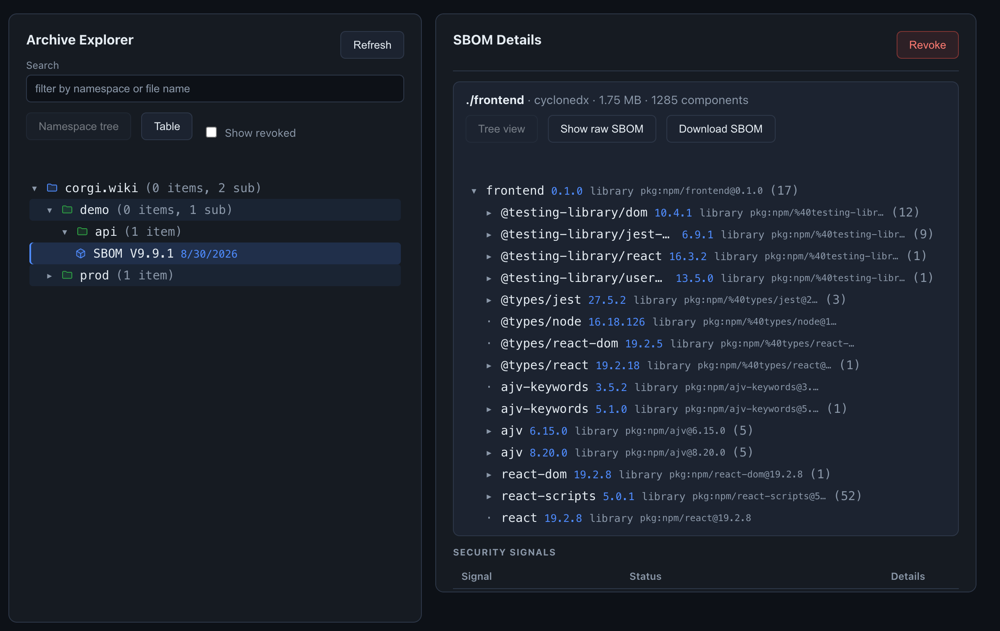
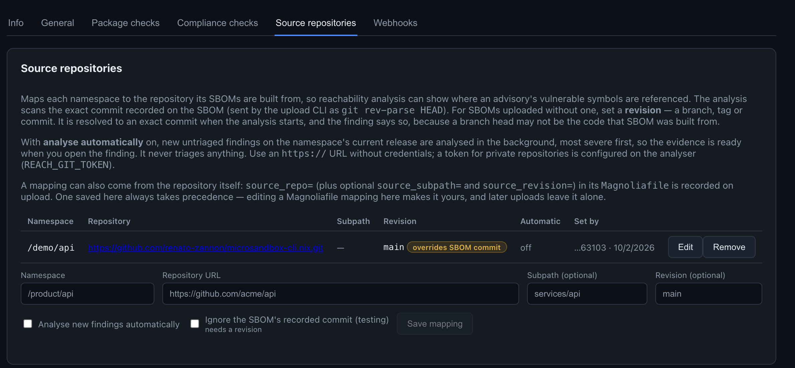
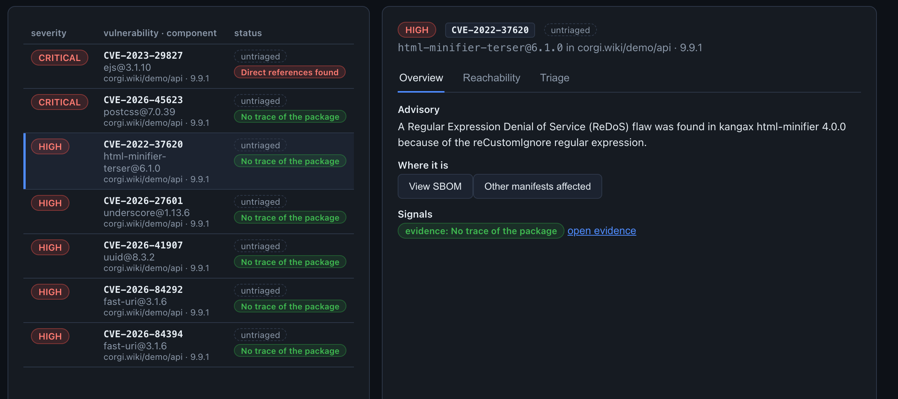
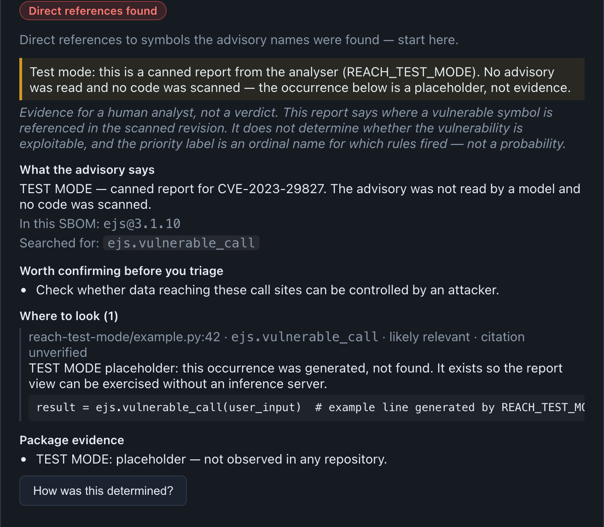
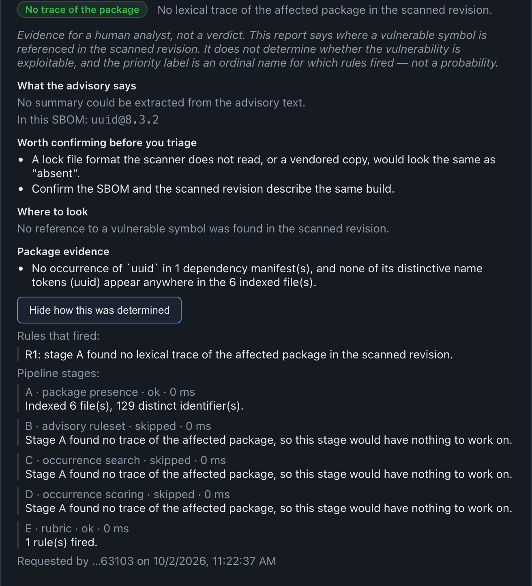
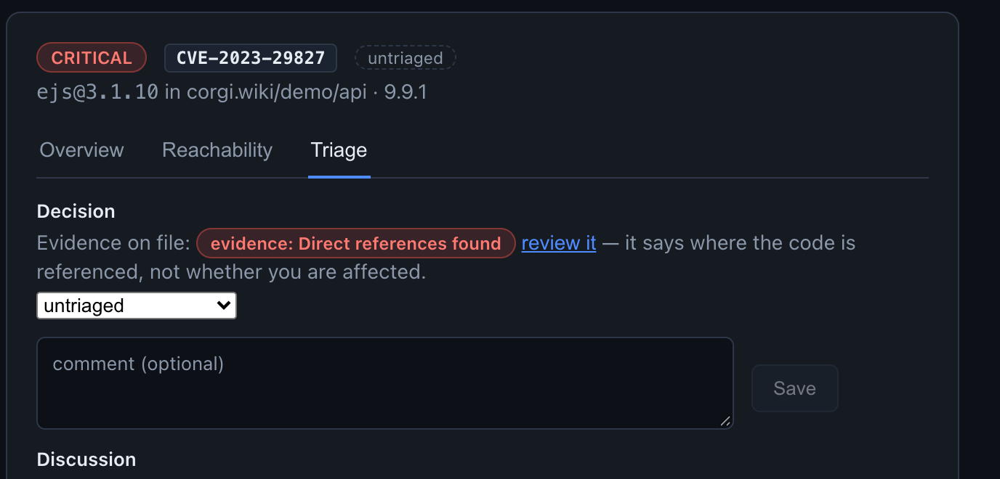
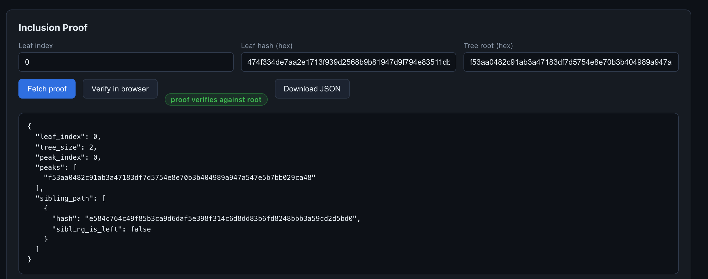

<!-- theme: gaia -->
<!-- _class: lead -->
<!-- _paginate: false -->
<!-- _header: '' -->

◆ Magnolia

### Supply-chain transparency with CVE reachability evidence

AISE course project 

<!--
One sentence: Magnolia keeps a signed, tamper-evident archive of a team's SBOMs and helps
analysts triage the vulnerability findings on them, using an LLM to show where in their
own code an advisory's vulnerable symbols are referenced.
-->

---

## The problem
### Do we know what we are running ? 

---

## The problem

  

    <h3>Trust in the record</h3>
    
"What exactly did you ship in 1.4.2, and when did you know?"

    <ul>
      <li>customers and regulators (EU Cyber Resilience Act) ask</li>
      <li>tamper proof</li>
    </ul>
  

  

    <h3>Too many findings</h3>
    
A finding says a dependency is vulnerable, not that <em>our</em> code uses the vulnerable part

    <ul>
      <li>dozens of findings per release</li>
      <li>checking them is time consuming</li>
    </ul>
  

Magnolia answers both: a signed log, and <strong>cited evidence</strong> for each finding.

<!--
The left problem is the transparency log; the right one is where the AI component lives.
-->

---

<!-- _class: compact -->

## Responsibility and core scenarios

> The service keeps a **signed, tamper-evident archive** of SBOMs and helps analysts **triage the findings** on them — Supported by an LLM

1. **CI publishes a release** — upload, policy checks, signed into the log with its commit
2. **An analyst triages a finding with evidence** core AI scenario
   - start an analysis → read the cited `file:line` evidence → record a VEX decision
3. **An auditor checks the record** — inclusion and consistency proofs in the browser, OpenVEX export

<!--
Scenario 2 is the vertical slice I demo. Scenarios 1 and 3 are the non-AI substance around it.
-->

---

<!-- _class: compact -->

## Architecture

<!--
Two services. api (Magnolia) owns the log, findings, triage, settings and the UI's API.
reach owns analyses and reports, with its own SQLite. They talk only over REST — no shared
database, no shared code; reach is even a separate Cargo project. Magnolia works fully
without reach; reach starts and is usable on its own through its API and Swagger UI.
The LLM is reached only by reach, through the OpenAI-compatible endpoint.
-->

---

<!-- _class: compact -->

## Design decisions

  

    <h3>Evidence, never a verdict</h3>
    
The analyst decides

    <ul>
      <li>"<code>yaml.load</code> at <code>src/config.py:12</code>" is evidence</li>
    </ul>
  

  

    <h3>Pinned to a commit</h3>
    
Reproducible evidence

    <ul>
      <li>the SBOM's recorded commit is scanned</li>
      <li>a branch is resolved once; overrides are labelled</li>
    </ul>
  

  

    <h3>Signed, append-only log</h3>
    
Tamper-evident by construction

    <ul><li>Merkle Mountain Range, Ed25519, DSSE/in-toto</li></ul>
  

  

    <h3>Degrade, don't break</h3>
    
Every integration is optional

  

---

<!-- _class: dense -->

## Persistence, UI and API

| | Magnolia (`api`) | `reach` (AI) |
|---|---|---|
| **Persistence** | PostgreSQL, 23 tables: log, manifests, findings + triage, settings, audit, archived reports · SBOM files · signing key | SQLite: analyses with input, status and full report · git cache |
| **API** | REST, 78 endpoints, documented in `docs/API.md`; role- and namespace-scoped API keys | REST, generated OpenAPI + Swagger UI |
| **UI** | React: **Findings** (list · Overview · Reachability · Triage), archive explorer, proofs, search, settings | — (used through Magnolia's UI) |
| **Integration** | Dependency-Track, OSV, deps.dev, webhooks, upload CLI + `Magnoliafile` | OpenAI-compatible LLM server |

AI results are persisted twice: in reach's database, and as an archived copy on the finding — evidence survives an analyser reset.

---

<!-- _class: lead -->
<!-- _paginate: false -->

# Demo

### CI upload → finding → reachability evidence → triage

<!--
Live demo, scenario 2:
1. stack is up: ./scripts/stack-up.sh --frontend
2. Findings → "Known source only" → pick a critical finding → Overview (advisory)
3. Reachability → Analyze reachability → badge in the list turns to "analysing…"
4. Report: priority label, extracted symbols, preconditions to confirm, Where to look
   with file:line links, "How was this determined?"
5. Triage tab: set VEX status + justification + comment → audit log
Fallback if the model is slow: REACH_TEST_MODE (labelled canned report) or a recorded run.
-->

---

<!-- _class: shot -->

## 1CI upload → a signed, browsable SBOM

Archive explorer: the uploaded CycloneDX SBOM of <code>/demo/api</code> 9.9.1 with its component tree; signals and the signature further down

<!--
Scenario 1. The CLI uploaded this SBOM; it is stored, appended to the Merkle log and signed (DSSE). Revocation is a flag, never a delete.
-->

---

<!-- _class: shot -->

## 2Tell Magnolia where the code lives

Settings → Source repositories: one repository per namespace, set here or by an upload's <code>Magnoliafile</code>; the testing override is badged

<!--
Without a mapping there is nothing to scan; the finding explains why the button is disabled.
-->

---

<!-- _class: shot -->

## 3Pick a finding

Findings: list beside the selected finding; evidence badges per row; <em>Overview</em> shows the advisory

<!--
Filters: severity, triage status, currently running, known source only. The list is server-paginated.
-->

---

<!-- _class: shot -->

## 4Read the evidence

- **Priority label** — names the rules that fired, not a probability
- **Disclaimer** on every report: evidence, not a verdict
- **What the advisory says** and the symbols searched for
- **Worth confirming** before triaging
- **Where to look**: `file:line` · symbol · label · citation status, reason, snippet
- test mode this report is canned — the banner says so; a real report has the same layout

<!--
Honest note: the demo data has no repository that uses a vulnerable function, so the only 'direct references' report on file is a test-mode one, and the banner says so. The layout is identical for a real report.
-->

---

<!-- _class: shot -->

## 5A real analysis on the demo data

- **Stage A** found no trace of `uuid` in the scanned revision
- so **B–D are skipped** — no model call is spent
- **Package evidence** says what was searched and where
- **Worth confirming**: a lock file the scanner can't read would look the same
- **How was this determined?** — every rule that fired, every stage with its outcome and duration

<!--
This is the honest result for the current demo data: the namespace is mapped to a repository that does not contain the package. No model call was spent.
-->

---

<!-- _class: shot -->

## 6Decide and record

Triage tab: the VEX decision and the discussion live apart from the AI evidence, which is linked but never pre-fills the decision

<!--
not_affected requires an OpenVEX justification. Every change is audit-logged and pushed to Dependency-Track.
-->

---

<!-- _class: shot -->

## 7The auditor's check

Proofs: an inclusion proof fetched from the API and verified in the browser ("proof verifies against root"); the consistency proof below it verifies the same way

<!--
Scenario 3. The verification runs client-side (frontend/src/merkle.ts), so it doesn't trust the server's own check.
-->

---

<!-- _class: compact -->

## The AI component: a five-stage pipeline

  
<h3>A</h3>
Package present?
<ul><li>manifests, lock files, identifier index</li><li>absent → stop, <strong>no LLM call</strong></li></ul>

  
<h3>B · LLM</h3>
Advisory → ruleset
<ul><li>vulnerable symbols, patterns, preconditions</li><li>JSON-validated</li></ul>

  
<h3>C</h3>
Find occurrences
<ul><li>lexical + tree-sitter for 4 languages</li><li>ranked, capped</li></ul>

  
<h3>D · LLM</h3>
Label each site
<ul><li><code>likely_relevant</code> · <code>unclear</code> · <code>likely_irrelevant</code></li><li>must cite a line</li></ul>

  
<h3>E</h3>
Rubric
<ul><li>pure function: fired rules → priority label + trace</li></ul>

The model does two <strong>narrow, validated</strong> jobs. Remove it and you're left with a keyword search — the evaluation measures that difference.

<!--
Blue = LLM, grey = deterministic. Model: any OpenAI-compatible server, configured by REACH_AI_*.
-->

---

<!-- _class: compact -->

## Uncertainty: labels, not probabilities

- **Grounding** — an extracted symbol that isn't in the advisory text is **dropped**
- **Citation check** — a claim must cite a line that exists *and* was in the snippet the model saw, or it's **dropped**
- **Invalid answers** — an invented label is dropped; the occurrence stays, unlabelled
- **`unclear`** is a first-class answer, not an error
- The priority label names **which rubric rules fired** — no confidence number, because none is calibrated
- Every report **counts what it dropped** and carries its own disclaimer

  illustration · Direct references found src/config.py:12 · <code>yaml.load</code> · likely relevant · citation verified
<pre>cfg = yaml.load(request.data)</pre>

---

<!-- _class: dense -->

## Failure handling

| Condition | What happens |
|---|---|
| **Inference server unavailable** | Stages B/D record the failure; report keeps the deterministic occurrences, unlabelled — never a 5xx. Magnolia keeps working and serves the archived report |
| **Timeout** | `REACH_AI_TIMEOUT_SECS` bounds every call; handled as a stage failure |
| **Malformed model output** | Validated app-side; **one repair retry**, then the stage degrades; ungrounded / uncited / invalid answers dropped and counted |
| **Input cannot be processed** | Bad advisory, commit or URL → `400` before queueing; unfetchable repo → `failed` with a reason; a crash fails only that job |
| **Storage read/write fails** | Logged, generic JSON `500`, never a partial result; worker retries next pass |

Known gap: <code>reach</code> refuses to start when the model is unreachable at startup — visible, but not a degraded start.

---

<!-- _class: compact -->

## Evaluation

**13 cases**, one script (`cargo run --bin eval`), results as JSON

- nominal · package absent · no symbols · **ambiguous** · **prompt injection** (advisory and code comment) · **malformed** · **out of scope** · advisory-only · lexical false positive · monorepo · **hallucination bait** · qualified generic symbol
- metrics: extraction P/R/F1, **non-AI keyword baseline** on the same inputs, priority accuracy, citation pass rate, structured-output first try, injection resistance, latency

| Run | Cases | Result |
|---|---|---|
| Deterministic path only | 13 | 13/13 pass · 2/2 injections resisted · baseline F1 0.73 |
| Hosted Qwen 3.6 35B | 1 | AI P/R **1.00** vs. baseline **0.00** · 165 s |
| Local deepseek-r1:8b | 1 | AI F1 1.00 vs. 0.67 · one repair retry · 479 s |

Open: a full AI run over all 13 cases after the last prompt change, and the written failure analysis.

<!--
Case 13 is the sharpest baseline comparison: an advisory naming yaml.load — the keyword
baseline drops "load" as too generic and reports nothing; the model keeps the qualified form.
-->

---

<!-- _class: compact -->

## Agent harness and sandbox

- **Claude Code**, Sonnet 5 for routine, Opus 5.5 for hard tasks
- **microsandbox** Linux VM on the macOS hypervisor
- only the **workspace** is mounted
- network **not restricted** — documented trade-off
- destructive / outward actions need **confirmation**

<!--
Honest note from the dev log: the last session ran on the host, not in the VM — it's recorded
in episode 12's session note.
-->

---

<!-- _class: compact -->

## What the agent got wrong — and what caught it

  
<h3>Destructive git command</h3>
Episode 3
<ul><li>a checkout wiped uncommitted work beyond its apparent scope</li></ul>

  
<h3>A fabricated artefact</h3>
Episode 8
<ul><li>a plausible but invented Argon2 hash</li></ul>

  
<h3>Done at the wrong layer</h3>
Episodes 2, 12
<ul><li>backend right, UI wrong; a rework shipped without being looked at</li></ul>

  
<h3>Docs drift like code</h3>
Episode 14
<ul><li>diagrams and README claims contradicted the code</li></ul>

---

<!-- _class: lead -->
<!-- _paginate: false -->
<!-- _header: '' -->

◆ Questions

README · ARCHITECTURE.md · docs/API.md · reach/README.md · docs/AI_DEVLOG.md

